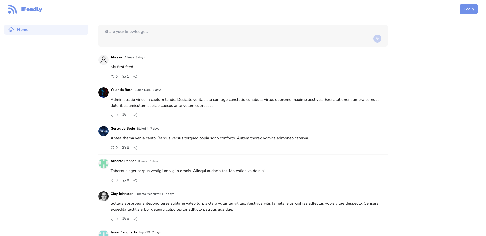
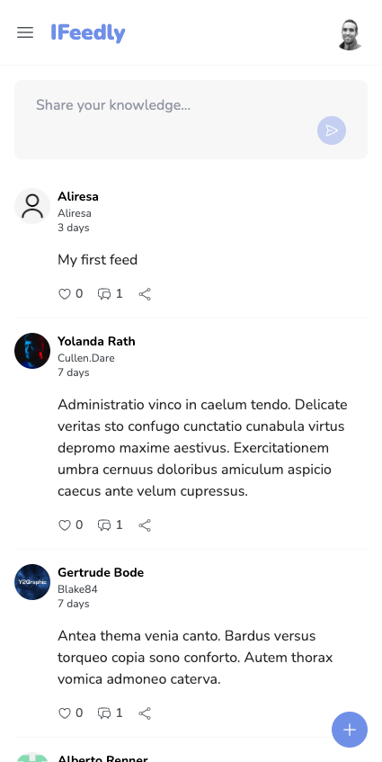
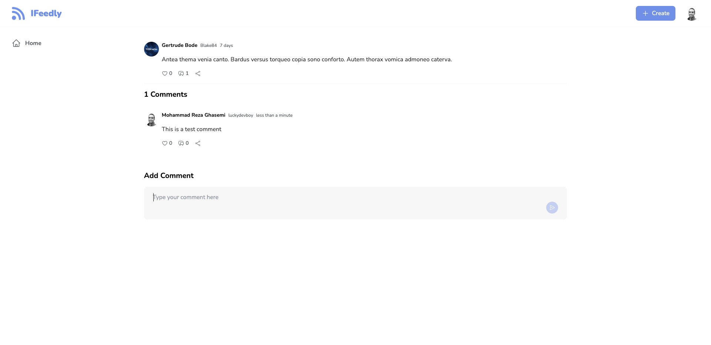
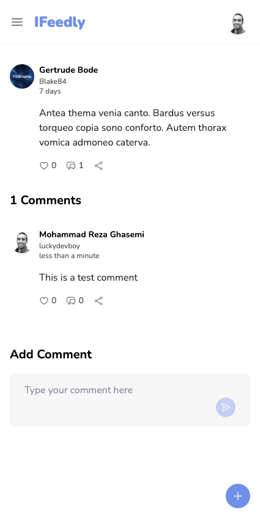
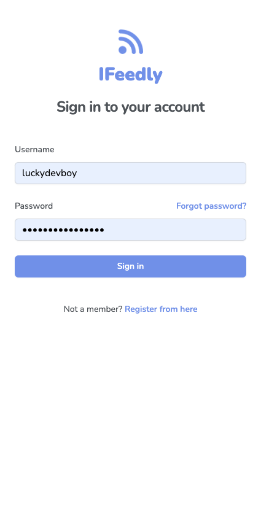

IFeedly is a news feed application containing a list of posts users can interact with.

### Technologies I've used

- Web Framework: [Next.js](https://nextjs.org/)
- CSS Framework: [Tailwind CSS](https://tailwindcss.com/)
- HTTP Client: [Axios](https://axios-http.com/docs/intro)
- Asynchronous State Management: [React Query](https://tanstack.com/query/latest)
- Auth Framework: [NextAuth](https://next-auth.js.org/)
- Motion Library: [Framer Motion](https://www.framer.com/motion/)

### Screenshots

#### Home Page Desktop View

#### Home Page Mobile View

#### Post Page Desktop View

#### Post Page Mobile View

#### Login Page

